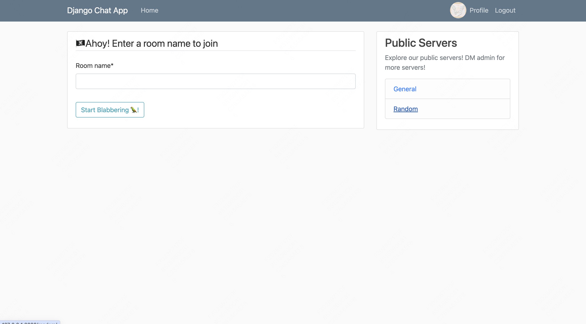
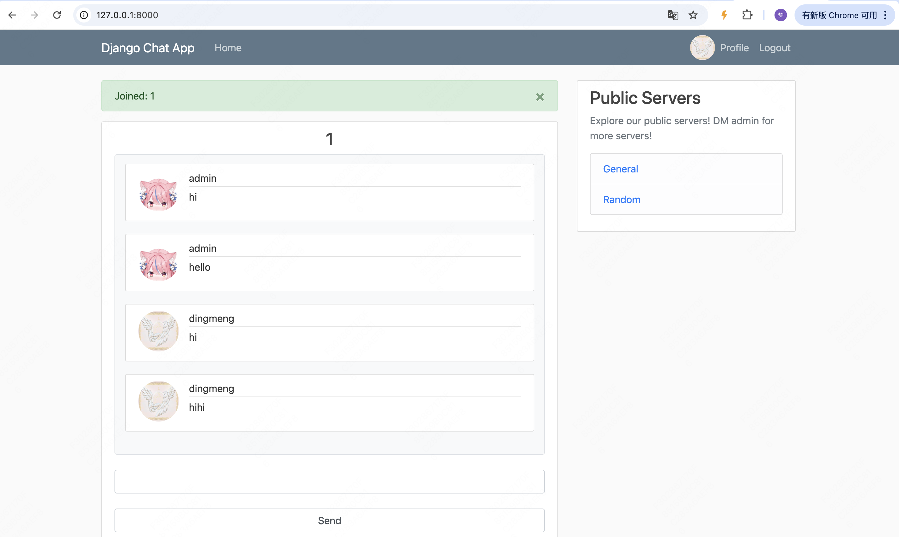
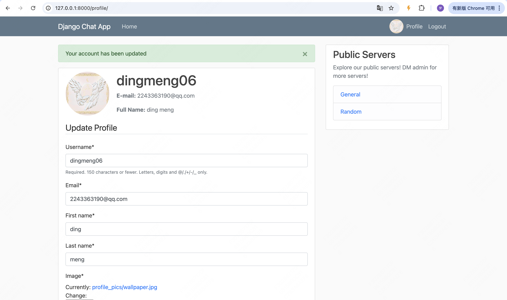
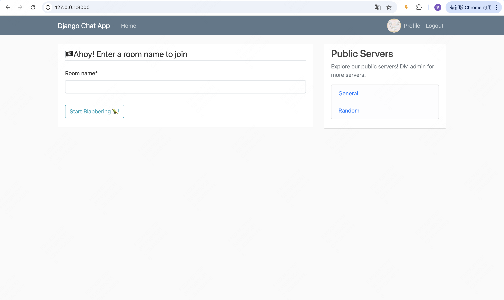
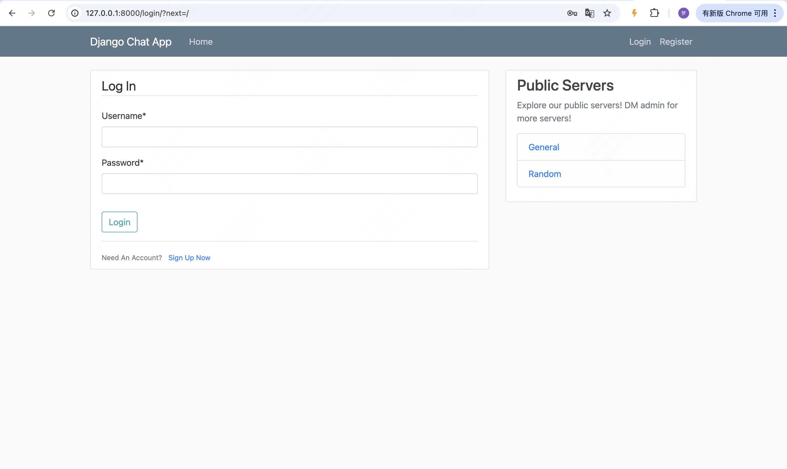
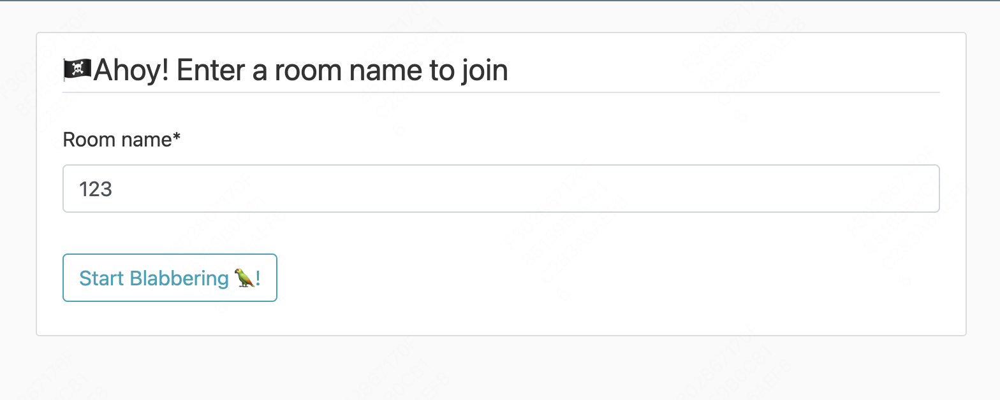
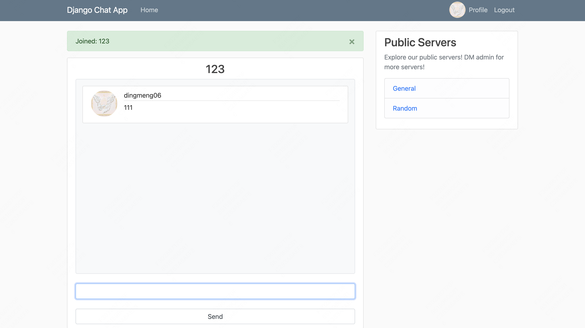
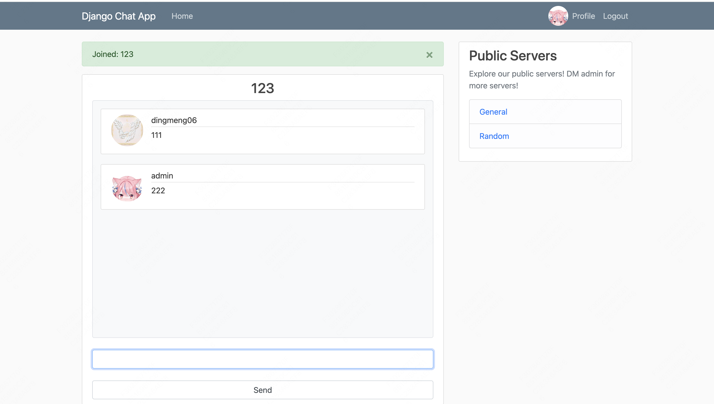
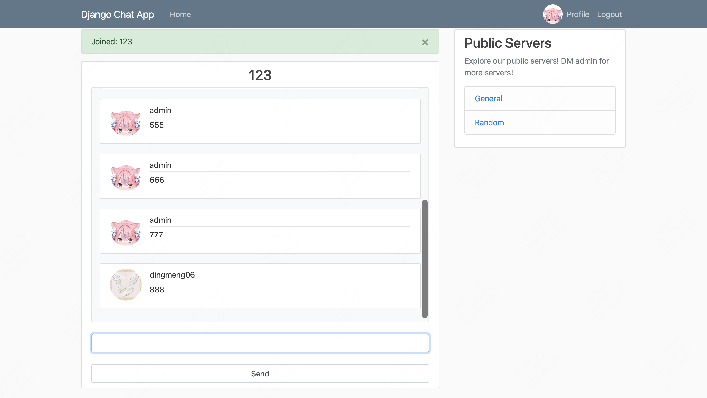

# 4. 前端界面与交互技术实现

## 4.1 模板系统的使用

Django-ChatApp项目使用了Django的模板系统来构建前端界面,主要包含以下几个模板文件:

### 1. base.html - 基础模板

```1:92:Django-ChatApp/chat/templates/chat/base.html

<!DOCTYPE html>
<html>
<head>

    <!-- Required meta tags -->
    <meta charset="utf-8">
    <meta name="viewport" content="width=device-width, initial-scale=1, shrink-to-fit=no">

    <!-- Bootstrap CSS -->
    <link rel="stylesheet" href="https://maxcdn.bootstrapcdn.com/bootstrap/4.0.0/css/bootstrap.min.css" integrity="sha384-Gn5384xqQ1aoWXA+058RXPxPg6fy4IWvTNh0E263XmFcJlSAwiGgFAW/dAiS6JXm" crossorigin="anonymous">

    <link rel="stylesheet" type="text/css" href="">

    
        <title>Django Chat App - {{ title }}</title>
    
        <title>Django Chat App</title>
    
</head>
<body>
    <header class="site-header">
      <nav class="navbar navbar-expand-md navbar-dark bg-steel fixed-top">
        <div class="container">
          <a class="navbar-brand mr-4" href="">Django Chat App</a>
          <button class="navbar-toggler" type="button" data-toggle="collapse" data-target="#navbarToggle" aria-controls="navbarToggle" aria-expanded="false" aria-label="Toggle navigation">
          <span class="navbar-toggler-icon"></span>
          </button>
          <div class="collapse navbar-collapse" id="navbarToggle">
            <div class="navbar-nav mr-auto">
              <a class="nav-item nav-link" href="">Home</a>
            </div>
            <!-- Navbar Right Side -->
            <div class="navbar-nav">
              
              
                <a class="nav-item nav-link" href=""> Profile</a>
                <a class="nav-item nav-link" href="">Logout</a>
              
                <a class="nav-item nav-link" href="">Login</a>
                <a class="nav-item nav-link" href="">Register</a>
              
            </div>
          </div>
        </div>
      </nav>
    </header>
    <main role="main" class="container">
      <div class="row">
        <div class="col-md-8">
          
            
                <div class="alert alert-{{ message.tags }} alert-dismissible fade show" role="alert">
                {{ message }}
                <button type="button" class="close" data-dismiss="alert" aria-label="Close">
                    <span aria-hidden="true">&times;</span>
                </button>
                </div>
              
          
          
        </div>
        <div class="col-md-4">
          <div class="content-section">
            <h3>Public Servers</h3>
            <p class='text-muted'>Explore our public servers! DM admin for more servers!
              <ul class="list-group">
                
                <li class="list-group-item list-group-item-light"> No public servers available ATM </li>
                
                
                <li class="list-group-item list-group-item-light">
                    <a href="">
                        {{room.name}}
                    </a> 
                </li>
                
                
              </ul>
            </p>
          </div>
        </div>
      </div>
    </main>

    <!-- Optional JavaScript -->
    <!-- jQuery first, then Popper.js, then Bootstrap JS -->
    <script src="https://code.jquery.com/jquery-3.2.1.slim.min.js" integrity="sha384-KJ3o2DKtIkvYIK3UENzmM7KCkRr/rE9/Qpg6aAZGJwFDMVNA/GpGFF93hXpG5KkN" crossorigin="anonymous"></script>
    <script src="https://cdnjs.cloudflare.com/ajax/libs/popper.js/1.12.9/umd/popper.min.js" integrity="sha384-ApNbgh9B+Y1QKtv3Rn7W3mgPxhU9K/ScQsAP7hUibX39j7fakFPskvXusvfa0b4Q" crossorigin="anonymous"></script>
    <script src="https://maxcdn.bootstrapcdn.com/bootstrap/4.0.0/js/bootstrap.min.js" integrity="sha384-JZR6Spejh4U02d8jOt6vLEHfe/JQGiRRSQQxSfFWpi1MquVdAyjUar5+76PVCmYl" crossorigin="anonymous"></script>
</body>
</html>
```


base.html作为基础模板实现了:
- 使用Bootstrap进行响应式布局
- 实现了导航栏和用户认证状态显示
- 定义了内容块和侧边栏布局
- 集成了必要的CSS和JavaScript资源

### 1. 技术原理

base.html作为基础模板采用了以下技术实现:

### 1.1 Django模板语言
- 使用``加载静态文件
- 使用`  `进行条件渲染
- 使用``定义内容块
- 使用`{{ variable }}`进行变量渲染

#### 1.2 响应式布局

```8:11:Django-ChatApp/chat/templates/chat/base.html
    <meta name="viewport" content="width=device-width, initial-scale=1, shrink-to-fit=no">

    <!-- Bootstrap CSS -->
    <link rel="stylesheet" href="https://maxcdn.bootstrapcdn.com/bootstrap/4.0.0/css/bootstrap.min.css" integrity="sha384-Gn5384xqQ1aoWXA+058RXPxPg6fy4IWvTNh0E263XmFcJlSAwiGgFAW/dAiS6JXm" crossorigin="anonymous">
```

- 使用Bootstrap 4实现响应式布局
- 使用viewport meta标签确保移动设备适配

#### 1.3 用户认证状态管理

```35:42:Django-ChatApp/chat/templates/chat/base.html
              
              
                <a class="nav-item nav-link" href=""> Profile</a>
                <a class="nav-item nav-link" href="">Logout</a>
              
                <a class="nav-item nav-link" href="">Login</a>
                <a class="nav-item nav-link" href="">Register</a>
              
```

- 使用Django的认证系统判断用户登录状态
- 根据状态显示不同的导航选项

## 2. 功能实现

base.html实现了以下核心功能:

### 2.1 页面结构
- 响应式导航栏
- 主内容区域(8列)
- 侧边栏(4列)
- 消息提醒系统

### 2.2 导航功能
- 网站标识和主页链接
- 用户状态相关链接(登录/注册/个人资料/登出)
- 用户头像显示

### 2.3 公共聊天室列表

```63:82:Django-ChatApp/chat/templates/chat/base.html
        <div class="col-md-4">
          <div class="content-section">
            <h3>Public Servers</h3>
            <p class='text-muted'>Explore our public servers! DM admin for more servers!
              <ul class="list-group">
                
                <li class="list-group-item list-group-item-light"> No public servers available ATM </li>
                
                
                <li class="list-group-item list-group-item-light">
                    <a href="">
                        {{room.name}}
                    </a> 
                </li>
                
                
              </ul>
            </p>
          </div>
        </div>
```

- 在侧边栏显示可用的公共聊天室
- 动态渲染聊天室列表
- 空状态处理



### 2.4 消息通知系统

```51:60:Django-ChatApp/chat/templates/chat/base.html
          
            
                <div class="alert alert-{{ message.tags }} alert-dismissible fade show" role="alert">
                {{ message }}
                <button type="button" class="close" data-dismiss="alert" aria-label="Close">
                    <span aria-hidden="true">&times;</span>
                </button>
                </div>
              
          
```
主要特点:

- 支持显示系统消息
- 支持不同类型的消息(success, error, warning, info)
- 可关闭的警告框
- 响应式布局
- Bootstrap样式集成

消息通知系统在以下几个主要场景中被使用:

## 1. 用户认证相关

### 1.1 登录成功/失败提醒
当用户尝试登录时:
- 登录成功: 显示"Successfully logged in"的成功消息
- 登录失败: 显示"Invalid username or password"的错误消息

### 1.2 注册相关提醒
- 注册成功: 显示"Your account has been created! You can now login"的成功消息
- 表单验证失败: 显示具体的验证错误信息

## 2. 聊天室操作

### 2.1 房间创建/加入

- 成功创建房间: 显示"Room created successfully"
- 加入已存在房间: 显示"Joined room successfully"
- 房间不存在: 显示"Room does not exist"的错误消息



### 2.2 WebSocket连接状态

- 连接断开: 显示"Chat connection closed unexpectedly"的警告消息

## 3. 个人资料操作

### 3.1 资料更新
- 更新成功: 显示"Your profile has been updated!"的成功消息
- 表单验证失败: 显示具体的验证错误信息



### 3.2 头像上传
- 上传成功: 显示"Profile picture updated successfully"
- 文件格式错误: 显示"Invalid file format"的错误消息


消息在视图函数中通过以下方式添加:
```python
from django.contrib import messages

messages.success(request, "Operation successful!")
messages.error(request, "Operation failed!")
messages.warning(request, "Warning message")
messages.info(request, "Information message")
```

这些消息会在base.html模板中统一渲染显示,确保了整个应用的消息通知体验的一致性。


1. 登录状态下的完整页面



2. 未登录状态下的导航栏




### 2. index.html - 首页模板

```1:19:Django-ChatApp/chat/templates/chat/index.html
  
<div class="content-section">
  <form method="POST">
    
    <fieldset class="form-group">
      <legend class="border-bottom mb-4">
        🏴‍☠️Ahoy! Enter a room name to join
      </legend>
      {{ form|crispy }}
    </fieldset>
    <div class="form-group">
      <button class="btn btn-outline-info" type="submit">
        Start Blabbering 🦜!
      </button>
    </div>
  </form>
</div>


```


index.html继承自base.html,实现了:

- 聊天室创建表单
- 使用crispy_forms美化表单样式

## 1. 功能实现

index.html作为应用的首页模板实现了以下功能：

1. 继承基础模板

```1:1:Django-ChatApp/chat/templates/chat/index.html
  
```


2. 创建/加入聊天室表单

```2:17:Django-ChatApp/chat/templates/chat/index.html
<div class="content-section">
  <form method="POST">
    
    <fieldset class="form-group">
      <legend class="border-bottom mb-4">
        🏴‍☠️Ahoy! Enter a room name to join
      </legend>
      {{ form|crispy }}
    </fieldset>
    <div class="form-group">
      <button class="btn btn-outline-info" type="submit">
        Start Blabbering 🦜!
      </button>
    </div>
  </form>
</div>
```


## 2. 技术原理与实现

### 2.1 模板继承
```html

```
**技术原理**：
- 使用Django模板系统的继承机制
- 继承base.html的整体布局和样式
- 通过block标签定义可覆盖的内容区域

**页面体现**：
[建议截图：完整页面布局，显示导航栏、侧边栏等继承自base.html的元素]

### 2.2 表单处理

```3:16:Django-ChatApp/chat/templates/chat/index.html
  <form method="POST">
    
    <fieldset class="form-group">
      <legend class="border-bottom mb-4">
        🏴‍☠️Ahoy! Enter a room name to join
      </legend>
      {{ form|crispy }}
    </fieldset>
    <div class="form-group">
      <button class="btn btn-outline-info" type="submit">
        Start Blabbering 🦜!
      </button>
    </div>
  </form>
```


**技术原理**：
1. CSRF保护：
```html

```
- 防止跨站请求伪造
- Django自动生成安全令牌

2. 表单渲染：
```html
{{ form|crispy }}
```
- 使用crispy_forms美化表单
- 自动处理表单字段布局和样式

3. 表单提交处理：

```14:18:Django-ChatApp/chat/views.py
    if request.method == 'POST' and form.is_valid():
        room_name = form.cleaned_data['room_name']
        db_messages = Message.objects.filter(room=room_name)[:]
        messages.success(request, f"Joined: {room_name}")
        return render(request, 'chat/chatroom.html', {'room_name': room_name, 'title': room_name, 'db_messages': db_messages})
```


**页面体现**：
[建议截图1：表单区域，显示输入框和提交按钮]


[建议截图2：crispy_forms美化后的表单样式]

### 2.3 UI设计

1. 标题设计：

```6:8:Django-ChatApp/chat/templates/chat/index.html
      <legend class="border-bottom mb-4">
        🏴‍☠️Ahoy! Enter a room name to join
      </legend>
```

- 使用emoji增加趣味性
- 清晰的引导文字

2. 按钮样式：

```12:14:Django-ChatApp/chat/templates/chat/index.html
      <button class="btn btn-outline-info" type="submit">
        Start Blabbering 🦜!
      </button>
```

- 使用Bootstrap的按钮样式
- 添加emoji作为装饰


### 2.4 交互处理

表单提交后的处理逻辑：

```9:20:Django-ChatApp/chat/views.py
@login_required()
def chat_home(request):

    form = RoomForm(request.POST or None)

    if request.method == 'POST' and form.is_valid():
        room_name = form.cleaned_data['room_name']
        db_messages = Message.objects.filter(room=room_name)[:]
        messages.success(request, f"Joined: {room_name}")
        return render(request, 'chat/chatroom.html', {'room_name': room_name, 'title': room_name, 'db_messages': db_messages})

    return render(request, 'chat/index.html', {'form': form})
```


**技术原理**：
- 登录验证装饰器确保用户已认证
- 表单验证
- 成功后重定向到聊天室
- 显示成功消息提醒

**页面体现**：
[建议截图1：表单提交成功后的消息提醒]
[建议截图2：重定向到聊天室页面的效果]




3. chatroom.html - 聊天室模板

```1:110:Django-ChatApp/chat/templates/chat/chatroom.html
  
<div class="content-section">
    <h3 class="text-center">{{room_name}}</h3>
    <div id="chat-log-container" 
        class="container bg-light p-3 rounded-sm border rounded overflow-auto"
        style="height: 480px; overflow-y:auto">
        <div id="chat-log">
            
            
            <div class="media content-section">
                
                <div class="media-body">
                    <div class="article-metadata">
                        <span class="mr-2"> {{m.username}}  </span>
                    </div>
                    <p class="article-content">  {{m.message_content}}  </p>
                </div>
            </div>
            
            
            <script>
                let myDiv = document.getElementById("chat-log-container");
                myDiv.scrollTop = myDiv.scrollHeight;
            </script>
        </div>
    </div>
    <br />
    <input
        class="form-control"
        id="chat-message-input"
        type="text"
        size="100"
        /><br />
    <input
        class="form-control"
        id="chat-message-submit"
        type="button"
        value="Send"
        />
        
     
    {{ room_name|json_script:"room-name" }}
    {{ request.user.username|json_script:"user-name" }}
    {{ request.user.profile.image.url|json_script:"profile-pic" }}
    <script>
        const roomName = JSON.parse(
          document.getElementById('room-name').textContent
        );
        const userName = JSON.parse(
          document.getElementById('user-name').textContent
        );
        const profilePic = JSON.parse(
          document.getElementById('profile-pic').textContent
        );
        
        const chatSocket = new WebSocket(
          'ws://' + window.location.host + '/ws/chat/' + roomName + '/'
        );
        
        chatSocket.onmessage = function (e) {
          const data = JSON.parse(e.data);
          if (data.message) {
            let html = '<div class="media content-section">';
                html += '';
                html += '<div class="media-body">';
                html += '<div class="article-metadata">';
                html += '<span class="mr-2">'+ data.username + '</span>';
                html += '</div>';
                html += '<p class="article-content">' + data.message + '</p>';
                html += '</div>';
                html += '</div>';
            document.querySelector('#chat-log').innerHTML += html
        
            let myDiv = document.getElementById("chat-log-container");
            myDiv.scrollTop = myDiv.scrollHeight;
          } else {
              alert("Message was empty")
          }
            
        };
        
        chatSocket.onclose = function (e) {
          console.error('Chat socket closed unexpectedly');
        };
        
        document.querySelector('#chat-message-input').focus();
        document.querySelector('#chat-message-input').onkeyup = function (e) {
          if (e.keyCode === 13) {
            // enter, return
            document.querySelector('#chat-message-submit').click();
          }
        };
        
        document.querySelector('#chat-message-submit').onclick = function (e) {
          const messageInputDom = document.querySelector('#chat-message-input');
          const message = messageInputDom.value;
          chatSocket.send(
            JSON.stringify({
              message: message,
              username: userName,
              profile_pic: profilePic,
              room: roomName,
            })
          );
          messageInputDom.value = '';
        };
    </script>
    
</div>

```


chatroom.html实现了:
- 聊天消息展示区域
- 消息输入框和发送按钮
- WebSocket连接和消息处理脚本


# Django聊天应用聊天室模板实现分析报告

## 1. 功能实现

chatroom.html作为聊天室模板实现了以下核心功能：

1. 聊天界面布局
2. 历史消息显示
3. 消息输入和发送
4. WebSocket实时通信
5. 自动滚动到最新消息

## 2. 技术原理与实现

### 2.1 基础布局


```1:6:Django-ChatApp/chat/templates/chat/chatroom.html
  
<div class="content-section">
    <h3 class="text-center">{{room_name}}</h3>
    <div id="chat-log-container" 
        class="container bg-light p-3 rounded-sm border rounded overflow-auto"
        style="height: 480px; overflow-y:auto">
```


**技术原理**：
- 继承base.html模板
- Bootstrap响应式布局
- 固定高度的滚动容器

**页面体现**：
[建议截图：整体聊天室布局，显示标题和消息容器]


### 2.2 历史消息显示


```8:20:Django-ChatApp/chat/templates/chat/chatroom.html
            
            
            <div class="media content-section">
                
                <div class="media-body">
                    <div class="article-metadata">
                        <span class="mr-2"> {{m.username}}  </span>
                    </div>
                    <p class="article-content">  {{m.message_content}}  </p>
                </div>
            </div>
            
            
```


**技术原理**：
- Django模板循环渲染历史消息
- Bootstrap媒体对象布局
- 用户头像和消息内容的组合显示

**页面体现**：
[建议截图：消息列表区域，显示用户头像、用户名和消息内容]



### 2.3 消息输入组件


```28:39:Django-ChatApp/chat/templates/chat/chatroom.html
    <input
        class="form-control"
        id="chat-message-input"
        type="text"
        size="100"
        /><br />
    <input
        class="form-control"
        id="chat-message-submit"
        type="button"
        value="Send"
        />
```


**技术原理**：
- Bootstrap表单控件
- 输入框和发送按钮组合
- 回车键发送功能

**页面体现**：
[建议截图：底部的消息输入框和发送按钮]


### 2.4 WebSocket通信实现


```41:58:Django-ChatApp/chat/templates/chat/chatroom.html
     
    {{ room_name|json_script:"room-name" }}
    {{ request.user.username|json_script:"user-name" }}
    {{ request.user.profile.image.url|json_script:"profile-pic" }}
    <script>
        const roomName = JSON.parse(
          document.getElementById('room-name').textContent
        );
        const userName = JSON.parse(
          document.getElementById('user-name').textContent
        );
        const profilePic = JSON.parse(
          document.getElementById('profile-pic').textContent
        );
        
        const chatSocket = new WebSocket(
          'ws://' + window.location.host + '/ws/chat/' + roomName + '/'
        );
```


**技术原理**：
1. 数据准备：
- 使用Django的json_script过滤器传递数据
- 解析房间名、用户名和头像URL

2. WebSocket连接：

```56:58:Django-ChatApp/chat/templates/chat/chatroom.html
        const chatSocket = new WebSocket(
          'ws://' + window.location.host + '/ws/chat/' + roomName + '/'
        );
```


**页面体现**：
[建议截图：开发者工具中的WebSocket连接状态]

### 2.5 消息处理


```60:80:Django-ChatApp/chat/templates/chat/chatroom.html
        chatSocket.onmessage = function (e) {
          const data = JSON.parse(e.data);
          if (data.message) {
            let html = '<div class="media content-section">';
                html += '';
                html += '<div class="media-body">';
                html += '<div class="article-metadata">';
                html += '<span class="mr-2">'+ data.username + '</span>';
                html += '</div>';
                html += '<p class="article-content">' + data.message + '</p>';
                html += '</div>';
                html += '</div>';
            document.querySelector('#chat-log').innerHTML += html
        
            let myDiv = document.getElementById("chat-log-container");
            myDiv.scrollTop = myDiv.scrollHeight;
          } else {
              alert("Message was empty")
          }
            
        };
```


**技术原理**：
1. 消息接收：
- 解析WebSocket消息
- 动态构建消息HTML
- 添加到消息容器

2. 自动滚动：

```74:75:Django-ChatApp/chat/templates/chat/chatroom.html
            let myDiv = document.getElementById("chat-log-container");
            myDiv.scrollTop = myDiv.scrollHeight;
```


**页面体现**：
[建议截图：新消息出现时的动态效果]



### 2.6 交互功能


```86:106:Django-ChatApp/chat/templates/chat/chatroom.html
        document.querySelector('#chat-message-input').focus();
        document.querySelector('#chat-message-input').onkeyup = function (e) {
          if (e.keyCode === 13) {
            // enter, return
            document.querySelector('#chat-message-submit').click();
          }
        };
        
        document.querySelector('#chat-message-submit').onclick = function (e) {
          const messageInputDom = document.querySelector('#chat-message-input');
          const message = messageInputDom.value;
          chatSocket.send(
            JSON.stringify({
              message: message,
              username: userName,
              profile_pic: profilePic,
              room: roomName,
            })
          );
          messageInputDom.value = '';
        };
```


**技术原理**：
1. 回车发送：
- 监听键盘事件
- Enter键触发发送

2. 消息发送：
- 获取输入内容
- 构建消息对象
- WebSocket发送
- 清空输入框

**页面体现**：
[建议截图：发送消息时的交互效果]


## 4.4 UI/UX设计

项目的UI/UX设计主要通过以下方式实现:

1. 使用Bootstrap框架实现响应式布局

```10:13:Django-ChatApp/chat/templates/chat/base.html
    <!-- Bootstrap CSS -->
    <link rel="stylesheet" href="https://maxcdn.bootstrapcdn.com/bootstrap/4.0.0/css/bootstrap.min.css" integrity="sha384-Gn5384xqQ1aoWXA+058RXPxPg6fy4IWvTNh0E263XmFcJlSAwiGgFAW/dAiS6JXm" crossorigin="anonymous">

    <link rel="stylesheet" type="text/css" href="">
```


2. 自定义CSS样式:

```1:83:Django-ChatApp/chat/static/chat/main.css
body {
    background: #fafafa;
    color: #333333;
    margin-top: 5rem;
  }
  
  h1, h2, h3, h4, h5, h6 {
    color: #444444;
  }
  
  ul {
    margin: 0;
  }
  
  .bg-steel {
    background-color: #5f788a;
  }
  
  .site-header .navbar-nav .nav-link {
    color: #cbd5db;
  }
  
  .site-header .navbar-nav .nav-link:hover {
    color: #ffffff;
  }
  
  .site-header .navbar-nav .nav-link.active {
    font-weight: 500;
  }
  
  .content-section {
    background: #ffffff;
    padding: 10px 20px;
    border: 1px solid #dddddd;
    border-radius: 3px;
    margin-bottom: 20px;
  }
  
  .article-title {
    color: #444444;
  }
  
  a.article-title:hover {
    color: #428bca;
    text-decoration: none;
  }
  
  .article-content {
    white-space: pre-line;
  }
  
  .article-img {
    height: 65px;
    width: 65px;
    margin-right: 16px;
  }
  
  .article-metadata {
    padding-bottom: 1px;
    margin-bottom: 4px;
    border-bottom: 1px solid #e3e3e3
  }
  
  .article-metadata a:hover {
    color: #333;
    text-decoration: none;
  }
  
  .article-svg {
    width: 25px;
    height: 25px;
    vertical-align: middle;
  }
  
  .account-img {
    height: 125px;
    width: 125px;
    margin-right: 20px;
    margin-bottom: 16px;
  }
  
  .account-heading {
    font-size: 2.5rem;
```


主要样式特点:
- 使用柔和的配色方案
- 清晰的信息层次
- 合理的留白和间距
- 圆角设计提升视觉体验
- 响应式布局适配不同设备

3. 交互体验优化:
- 消息自动滚动到底部
- 回车键发送消息
- 实时消息提醒
- 用户状态显示


